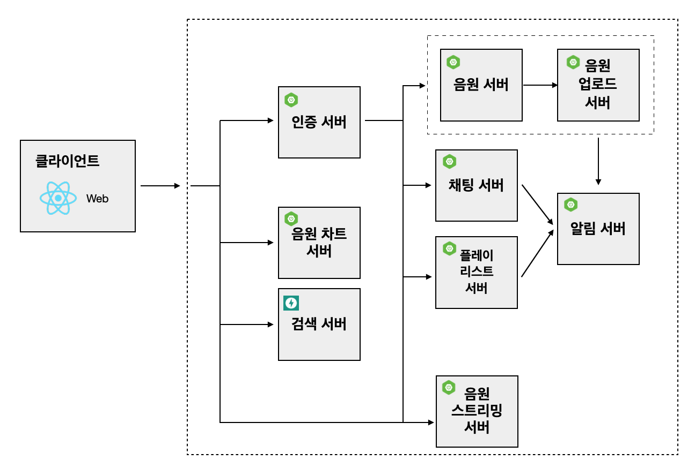

# 라라라 백엔드 서버

## 백엔드 폴더 구조
* 추후 수정

## 아키텍처
서버 아키텍처는 다음과 같습니다.

### 아키텍처 기능별 담당자
아키텍처 기능별 담당자는 다음과 같습니다.

* 음원 스트리밍 서버 : TBA
* 인증 서버 : TBA
* 음원 차트 서버 : TBA 
* 검색 서버 : TBA
* 음원 서버 : TBA
* 음원 업로드 서버 : TBA
* 채팅 서버 : TBA
* 플레이 리스트 서버 : TBA
* 알림 서버 : TBA