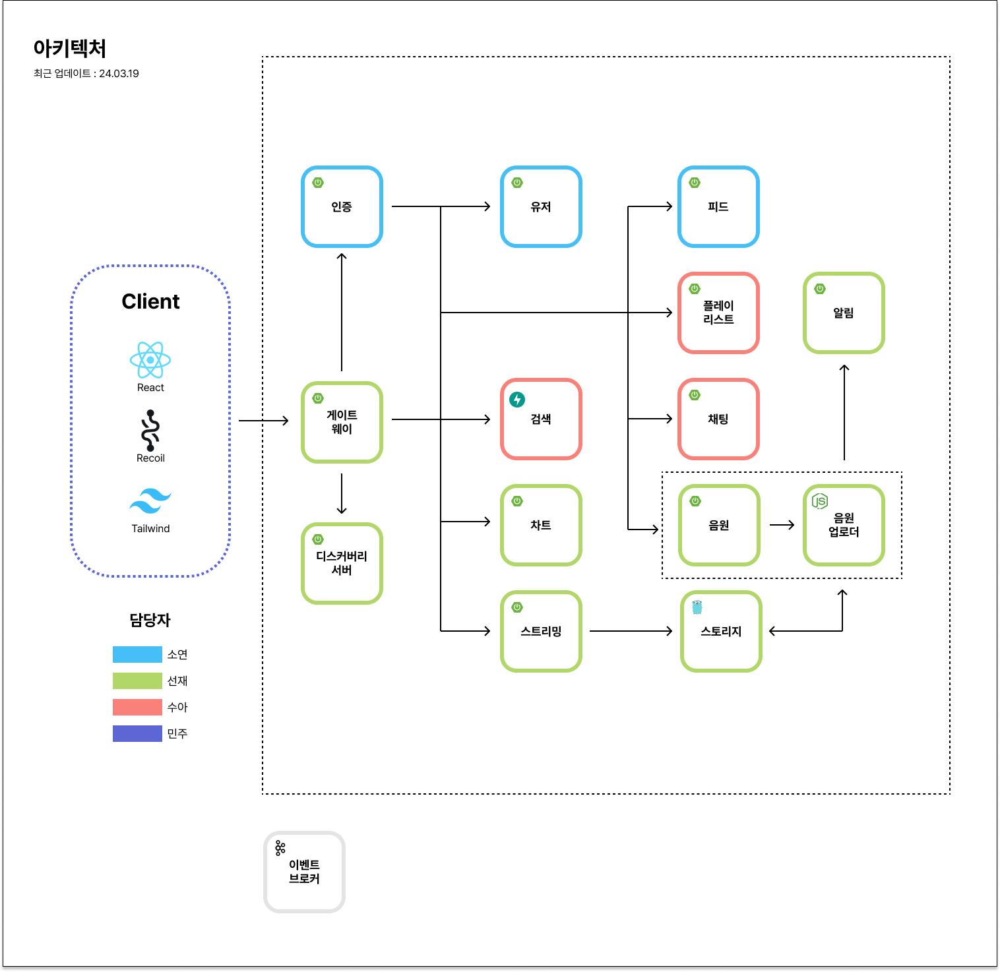

# 라라라 백엔드 서버

## 백엔드 폴더 구조

- `{이름}-server` 형식으로 서버를 구분합니다.  

## 아키텍처

서버 아키텍처는 다음과 같습니다.

### 1. 서버 흐름도

### 2. 서버 구성도

### 아키텍처 기능별 담당자

아키텍처 기능별 담당자는 다음과 같습니다.

- [인증 서버](./auth-server/README.md) : [happysoy](https://www.github.com/happysoy)
- [유저 서버](./user-server/README.md) : [happysoy](https://www.github.com/happysoy)
- [피드 서버](./feed-server/README.md) : [happysoy](https://www.github.com/happysoy)
- [채팅 서버](./chatting-server/README.md) : [suakang17](https://www.github.com/suakang17), [happysoy](https://www.github.com/happysoy)
- [검색 서버](./search-server/README.md) : [suakang17](https://www.github.com/suakang17)
- [플레이 리스트 서버](./playlist-server/README.md) : [suakang17](https://www.github.com/suakang17)
- [음원 스트리밍 서버](./streaming-server/README.md) : [kor-Chipmunk](https://www.github.com/kor-Chipmunk)
- [음원 차트 서버](./chart-server/README.md) : [kor-Chipmunk](https://www.github.com/kor-Chipmunk)
- [음원 서버](./music-server/README.md) : [kor-Chipmunk](https://www.github.com/kor-Chipmunk)
- [음원 업로더 서버](./music-uploader-server/README.md) : [kor-Chipmunk](https://www.github.com/kor-Chipmunk)
- [알림 서버](./alarm-server/README.md) : [kor-Chipmunk](https://www.github.com/kor-Chipmunk)
- [파일(스토리지) 서버](./storage-server/README.md) : [kor-Chipmunk](https://www.github.com/kor-Chipmunk)

### 도커 파일 종류

1. `docker-compose.yml`
    - 로컬 개발용 with IntelliJ
    - 서버 앱을 제외한 리소스
    - DNS : 서버 앱에서 Host DNS 으로 따름
    - 새로 빌드 및 기존 빌드로 실행
        - `./scripts/start_docker.sh`
2. `docker-compose-local.yml`
   - 로컬 도커 테스트용
   - 서버 앱 포함
   - 도커 허브 올리기 전 정상 동작 확인용
   - DNS : Docker ServiceName DNS 에 따름. 관련한 엔드포인트 설정 파일에서 환경변수로 넣어줘야 함.
   - 새로 빌드 및 기존 빌드로 실행
       - `./scripts/start_docker_local.sh`
   - 새로 빌드하여 실행
       - `./scripts/start_docker_local_build.sh`
3. `docker-compose-hub.yml`
   - 도커 허브에 빌드된 앱 포함
   - DNS : Docker ServiceName DNS 에 따름. 관련한 엔드포인트 설정 파일에서 환경변수로 넣어줘야 함.
   - 새로 빌드 및 기존 빌드로 실행
       - `./scripts/start_docker_hub.sh`

* 스크립트 권한 오류 : `chmod +x ./scripts/*`

* Docker ServiceName DNS : localhost:10000) (X) music-app:10000 (O)
    - 포트는 호스트(개인 컴퓨터)에 매핑된 주소가 아닌, 도커 컨테이너 내부에 생성되는 주소로 설정 (eg. chart-app 이 10000:8080 이면, chart-app:10000 (X), chart-app:8080 (O) )
    - host.docker.internal 을 사용하는 경우 호스트에 매핑된 포트로 매핑
* Host DNS : 호스트(개인 컴퓨터)에 매핑된 포트로 연결. chart-app:8080 (X), localhost:10000 (O)
